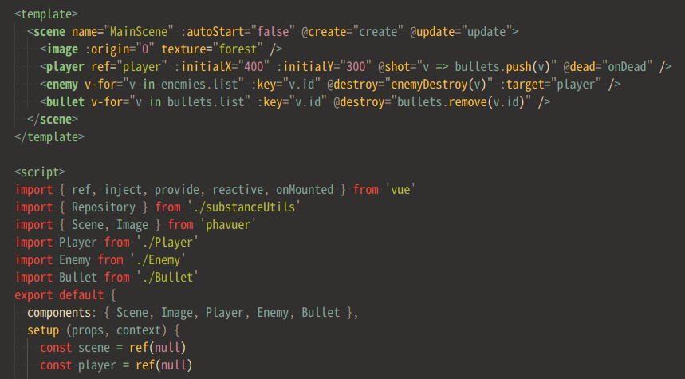

# Phavuer

[](https://github.com/photonstorm/phaser)
[](https://github.com/vuejs/vue-next)
[](https://www.npmjs.com/package/phavuer)
[](https://github.com/laineus/phavuer/blob/master/LICENSE)

  


Phavuer is a wrapper library that integrates [Phaser 3](https://github.com/photonstorm/phaser) with [Vue 3](https://github.com/vuejs/vue-next).  
It enables game development through declarative rendering.

- [Phavuer vs Phaser's plane API](https://codepen.io/laineus/pen/pobgxdE?editors=0010) - A Compilation by example UI.
- [Phavuer Example Shooter](https://github.com/laineus/phavuer-example) - A simple shooter that written in Phavuer.
- [Phavuer RPG Example](https://github.com/laineus/phavuer-rpg-example) - An RPG example (This is just a usage example. Not a completed Game.)
- ["The Dream Libra had"](https://github.com/laineus/libra) - An RPG made with Phavuer (Completed project and published on Steam).

\*\*\* **Attention** \*\*\*

- Currently, it supports basic Phaser functionalities and major GameObjects, but not all.
- While performance is not guaranteed, it will not be faster than using Phaser alone.
- Using Phavuer significantly alters the source code from standard Phaser. Please note that switching between the two is not straightforward.

Nevertheless, I am committed to using it for my own game development.  
Contributions are welcome.

# Usage example

**MainScene.vue:**

```vue
<template>
  <Scene name="MainScene">
    <Text @pointerdown="onClick" text="Add a Rectangle" />
    <Container v-for="(n, i) in count" :key="i" :x="i * 130" :y="30">
      <Rectangle :width="120" :height="30" :origin="0" :fillColor="0x333333" />
      <Text :x="60" :y="15" :origin="0.5" :text="`Rectangle-${n}`" />
      <MyCustomComponent />
    </Container>
  </Container>
</template>

<script>
import { Scene, Container, Rectangle, Text } from 'phavuer'
import { ref } from 'vue'
import MyCustomComponent from './MyCustomComponent.vue'
export default {
  components: { Scene, Container, Rectangle, Text, MyCustomComponent },
  setup () {
    const count = ref(1)
    const onClick = () => count.value++
    return { count, onClick }
  }
}
</script>
```

The template syntax is consistent with Vue 3 ([documentation](https://v3.vuejs.org/guide/template-syntax.html)).  
No original syntax is introduced.

Phaser3's GameObjects and their properties are used as components and props, respectively.  
The naming conventions are in line with the original names, making Phaser3's documentation directly applicable.

# Installation

## CDN

Phavuer requires Phaser 3 and Vue 3.  
Ensure Phavuer is loaded after these libraries.

```html
<script src="https://unpkg.com/phaser@3.70.0/dist/phaser.min.js"></script>
<script src="https://unpkg.com/vue@3.3.13/dist/vue.global.prod.js"></script>
<script src="https://unpkg.com/phavuer/dist/phavuer.min.js"></script>
```

```js
const { Game, Scene } = Phavuer
const MainScene = {
  components: { Game, Scene },
  template: '<Game><Scene>...</Scene></Game>',
  setup () {
    return {}
  }
}
const app = Vue.createApp(MainScene)
app.mount()
```

## Vite

### 1. Setup [Vite](https://github.com/vitejs/vite)

```bash
$ yarn create vite
```

Choose Vue in the 'Select a framework' section.  
Choose TypeScript (recommended) or JavaScript in the 'Select a variant' section.

### 2. Add Phaser and Phavuer

```bash
$ yarn add phavuer phaser
```

Add the following import statement at the beginning of `index.ts` or `index.js`.

```js
import 'phaser'
```

### 3. App.vue

```html
<template>
  <Game :config="gameConfig">
    <Scene name="MainScene">
      <Rectangle :x="100" :y="100" :width="100" :height="100" :fillColor="0xAAAAAA" />
    </Scene>
  </Game>
</template>

<script setup lang="ts"> or <script setup>
import { Game, Scene, Rectangle } from 'phavuer'
const gameConfig = { width: 960, height: 540 }
</script>
```

### 4. Run

```bash
$ yarn run dev
```

# API

## Components

### `Game`

The `Game` component is used to create a [Game](https://newdocs.phaser.io/docs/3.70.0/Phaser.Game) instance.

Props:

- `config`: ([GameConfig](https://newdocs.phaser.io/docs/3.70.0/Phaser.Types.Core.GameConfig)) Configuration settings for the Phaser game

Events:

- `create (game)`
- `boot (game)`
- `ready (game)`

### `Scene`

The `Scene` component is used to create a [Scene](https://newdocs.phaser.io/docs/3.70.0/Phaser.Scene).

Props:

- `name`: (String) Scene name
- `autoStart`: (Boolean) Scene is started immediately if `true`

Events:

- `init (scene, data)`
- `create (scene, data)`
- `update (scene, time, delta)`
- `preload (scene)`

Properties:

- `scene` Scene object

### GameObject Components

GameObject Components are fundamental elements corresponding to each [Phaser 3 GameObject](https://newdocs.phaser.io/docs/3.70.0/gameobjects), like `Sprite` or `Rectangle`.

Usage example: `<Rectangle :x="0" :y="0" :width="10" :height="10" />`

- Basic components return an instance of their GameObject, accessible via the key name `object`.
  - You can obtain it using a ref, like so: `<Rectangle ref="el" />` + `el.value.object` (externally accessed as `el.object`).
- An event for object creation can be specified with `@create`.
  - The parameter is `(GameObject)`.
- The majority of prop names are consistent with the property names of their respective GameObject.
- You can define a Tween for the object using `:tween`.
  - The `targets` in the options are automatically set.
  - The Tween is automatically removed prior to the object's destruction.

Currently, Phavuer supports the following base components:

- Container
- Image
- Sprite
- NineSlice
- Text
- Rectangle
- RoundRectangle
- Triangle
- Circle
- Line
- Zone
- TilemapLayer
- Light
- StaticBody
- Body

Phavuer currently supports major GameObjects, but not all. If you wish to use other GameObjects, please raise an issue or a Pull Request.  
You also have the option to create base components within your project. ([See here for reference](https://github.com/laineus/phavuer/tree/master/src/components))

## Methods

### `useGame()`

Return value:

Instance of [Phaser.Game](https://newdocs.phaser.io/docs/3.70.0/Phaser.Game)

### `useScene()`

Return value:

Instance of [Phaser.Scene](https://newdocs.phaser.io/docs/3.70.0/Phaser.Scene)

### `onPreUpdate(event)`

A method to register an event on pre update of the scene.

### `onPostUpdate(event)`

A method to register an event on post update of the scene.

### `refTo(value, key)`

Parameters:

`value`: Initial value
`key`: Key string of what property of given new value should be set

Return value:

Instance of `CustomRefImpl`

Usage:

Can be used to get such as a GameObject easily.

```js
const rectangle = refTo(null, 'object')
```

```html
<Rectangle ref="rectangle">
```

### `refObj(value)`

A sugar function for `refTo(value, 'object')`

### `refScene(value)`

A sugar function for `refTo(value, 'scene')`

## Methods (for contributers)

### `initGameObject(gameObject, props, context)`

This method endows the specified gameObject with the following features:

- Reactivity to specified props, such as `x` or `y` ([full list here](https://github.com/laineus/phavuer/tree/master/src/setters.js)).
- Automatic appending to the parent Container, if it exists.
- If a parent Container does not exist, it is automatically appended to the Scene.
- Automatic destruction when the component is unmounted.
- Ability to set interactive events like `@pointerup`.
- Ability to set an event for object creation using `@create`.

Parameters:

- `gameObject`: Phaser 3 GameObject instance
- `props`: Vue 3 props
- `context`: Vue 3 context

This method is utilized to define GameObject Components. ([Example here](https://github.com/laineus/phavuer/tree/master/src/components/Sprite.js))

If you simply wish to use your component within another component, this method is not necessary.  
In such cases, you only need to relay props to the default components.

